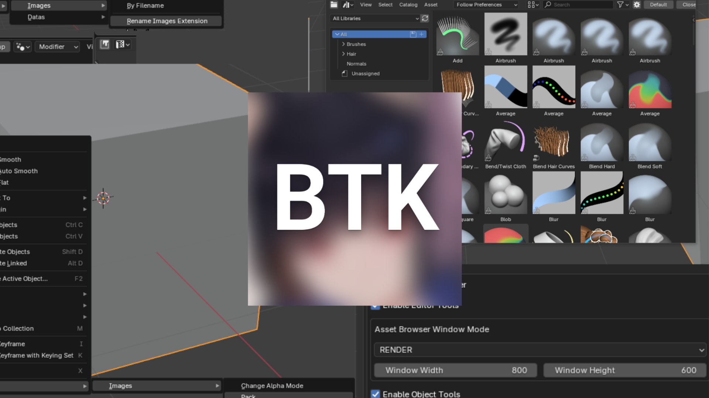

# bitsy_btk

This Blender addon is designed to offer quick tools for my workflow that could be usefull for others.

### Project Cleanup
- **Remove Unused Materials:** Automatically eliminate all unused material slots to keep your project clean.
- **Remove Duplicate Textures:** Remove duplicated textures by merging them in one data object.
- **Rename Images by Filename:** Rename all images based on their file names.
- **Batch File Extension Conversion:** Batch change the path file extensions for Images (Allowing you to convert them to another format and replace them quickly)
- **Data Renaming to Object:** Rename data blocks to match the object names

### Asset Management
- **Asset Browser Quick Access:** Open the Asset Browser in a new window or area with a single click for quick access to your assets.

### Object Tools
- **Pack & Unpack Images:** Pack or unpack all images for the selected object, making asset management more efficient.
- **Adjust Image Alpha Mode:** Change the alpha mode for all images used by the selected object in one go.

### Nodes
- **Center Nodes** Center all nodes in current or all nodegroup/material/geometry nodes/etc... and keep their relativity position.

### Editor Switching
- **Switch Between Editors:** Swap between the Image/UV Editor, Asset Browser/File Browser, and Geometry Nodes/Compositor/Material workspace instantly.

 

---

 

### It add in UI :
- a menu Bitsy in Blender menu for Project cleanup.
- a menu Bitsy in Object menu for Object Tools
- a menu Bitsy in NodeGraph view for Centering Nodes
- Buttons on left of the select editor type of UV/Image Asset/File Material/Compositor/Geometry Nodes, to quickly swap.
- Button in 3D View to open asset browser as new Area

You can disable module you don't want in addon settings.